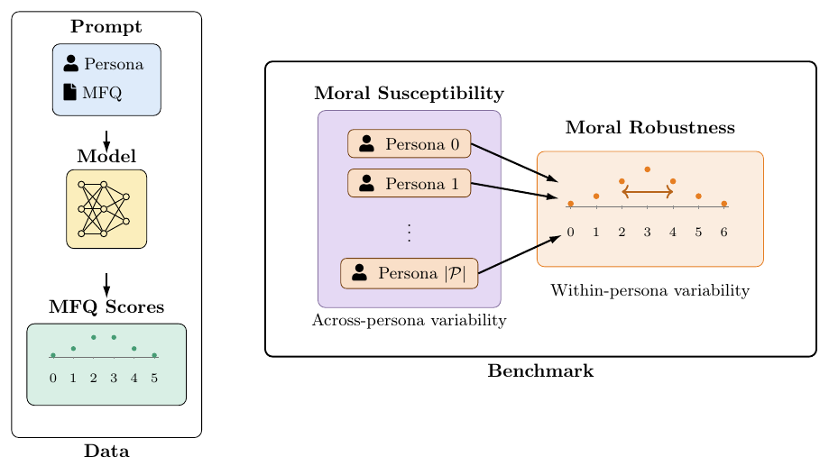
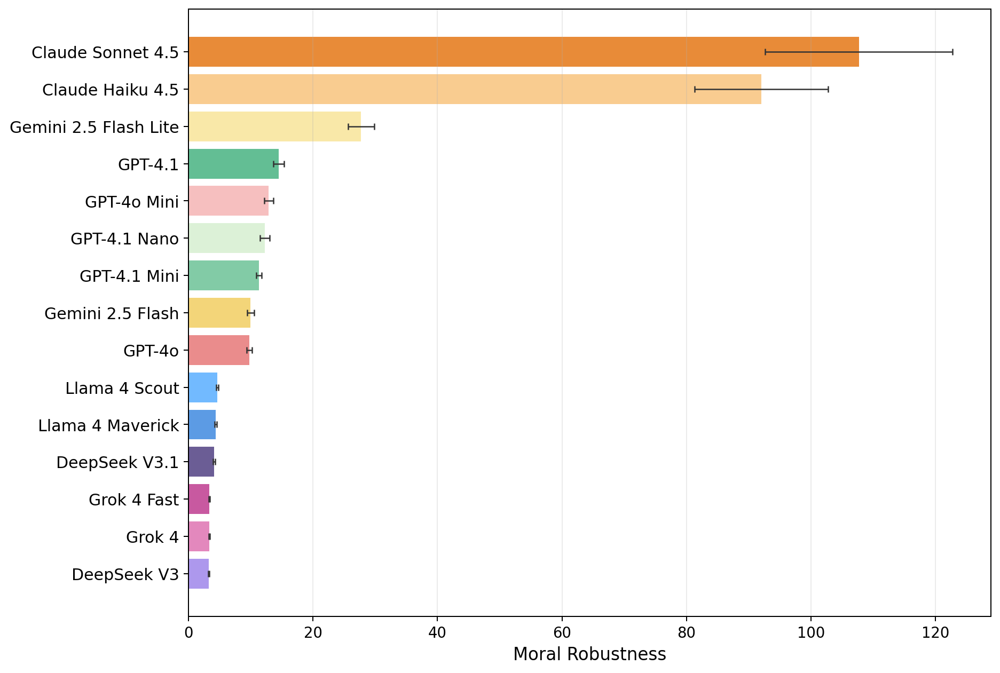
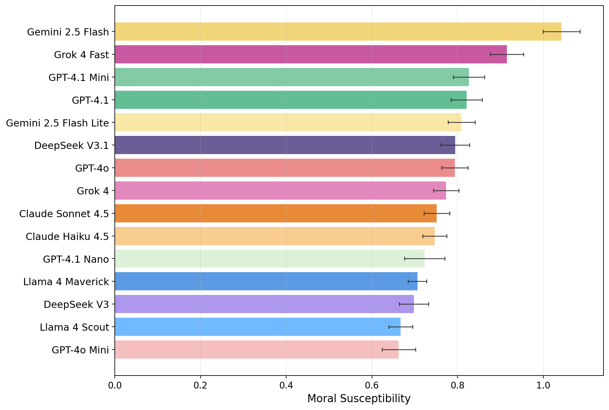
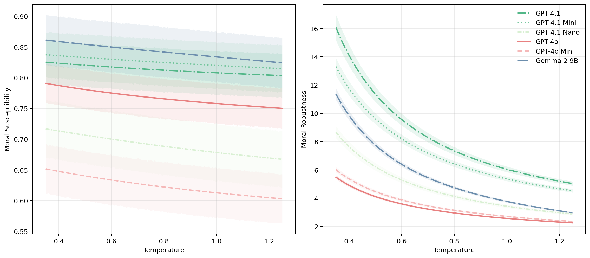

# Moral Susceptibility and Robutness Benchmark

This repository implements the benchmark introduced in [[arXiv 2511.08565]](https://arxiv.org/abs/2511.08565). It measures how large language models change their moral judgments under persona role-play, using the 30-item Moral Foundations Questionnaire (MFQ-30) to separate two effects:

- **Moral robustness (`R`)**: how stable a model's ratings are when the same persona answers the same MFQ item repeatedly.
- **Moral susceptibility (`S`)**: how much the expected MFQ rating shifts across personas.




## Benchmark Definition

Each model answers all 30 MFQ items either as `self` (no persona prompt) or as a sampled persona from `personas.json`. For persona-conditioned runs, the benchmark treats each `(persona, question)` pair as a small response distribution. From that data it computes:

- **Robustness** `R = 1/U`: the inverse of the average within-pair standard deviation. Higher means the model is more internally consistent when answering as a fixed persona (see the paper for detail).
- **Susceptibility** `S`: the average across MFQ questions of the standard deviation of the persona-level mean scores (see the paper for detail). Higher means persona conditioning moves the model's expected answers more strongly.

Metrics are computed with persona-bootstrap and rerun-bootstrap uncertainty estimates, decomposed across the five canonical moral foundations:

- `Harm/Care`
- `Fairness/Reciprocity`
- `In-group/Loyalty`
- `Authority/Respect`
- `Purity/Sanctity`

For measuring this quantities, two complementary workflows are supported:

- **Sampling workflow**: collect repeated integer ratings, compute `R`, `S` at a chosen temperature, plot benchmark bars.

<p align="center">
  
  
</p>

- **Logit/logprob workflow**: collect next-token digit score vectors then compute `R(T)`, `S(T)` analytically across any temperature range and plot curves.


<p align="center">
  
</p>

---

## Adding a Model

The full end-to-end workflow for adding a new model to the benchmark:

### 1. Register the model

Add an entry to `config/models.yaml`:

```yaml
- key: my-model
  label: "My Model"
  provider: openai          # openai | anthropic | google | openrouter | deepseek | xai | local_logits
  model_name: my-model-id
  capabilities:
    sampling: true
    logit: true             # only for providers that expose logprobs
```

Set API credentials in `.env` (see [Environment Setup](#environment-setup)).

### 2. Collect data

**Sampling workflow** — repeated integer ratings per (persona, question) pair:

```bash
python run_mfq_sampling.py --model my-model --temperature 0.1 --n 10 --p 100
```

Add `--self` to also collect a no-persona baseline:

```bash
python run_mfq_sampling.py --model my-model --temperature 0.1 --self
```

Outputs: `data/sampling/my-model_temp01.csv` (and `my-model_temp01_self.csv`)

**Logit/logprob workflow** — single first-token collection, temperature-reusable:

```bash
python run_mfq_logits.py --model my-model --p 100
```

Add `--self` for the no-persona baseline:

```bash
python run_mfq_logits.py --model my-model --self
```

Outputs: `data/logit/my-model_logprobs.csv` (and `my-model_self_logprobs.csv`)

### 3. Compute metrics

**From sampling data:**

```bash
python analysis/compute_metrics.py
```

Outputs: `results/persona_moral_metrics.csv`, `results/persona_moral_metrics_per_foundation.csv`

**From logit/logprob data** (produces temperature curves):

```bash
python analysis/compute_temperature_curve_metrics.py
```

Output: `results/temperature_curve_metrics.csv`

### 4. Generate plots

**Benchmark bar plots** (sampling workflow):

```bash
python analysis/plot_metrics.py --temperature 0.1
```

Outputs: `results/plots/robustness_temp01.png`, `results/plots/susceptibility_temp01.png`

**Temperature curve plots** (logit workflow):

```bash
python analysis/plot_temperature_curves.py
```

Output: `results/plots/temperature_curves_robustness_susceptibility.png`

---


## Repository Layout

```text
.
├── run_mfq_sampling.py          # Sampling collector (persona and --self modes)
├── run_mfq_logits.py            # Logit/logprob collector (persona and --self modes)
├── generate_persona_samples.py  # One-time script to regenerate personas.json
├── llm_interface.py             # Provider access layer (used by sampling)
├── model_registry.py            # Config loader, model registry, and data path helpers
├── mfq_questions.py             # Canonical MFQ-30 definitions and prompts
├── personas.json                # 100 persona descriptions for role-play runs
├── config/
│   ├── models.yaml              # Unified model registry
│   └── benchmark.yaml           # Default temperatures, n, p, and output paths
├── data/
│   ├── sampling/                # Raw repeated-query runs: <model>_tempXX.csv
│   └── logit/                   # First-token logprob collections: <model>_logprobs.csv
├── results/                     # Aggregated metrics, tables, and plots
├── analysis/
│   ├── compute_metrics.py                  # Sampling → U, R, S metrics
│   ├── compute_temperature_curve_metrics.py # Logit → R(T), S(T) curves
│   ├── plot_metrics.py                     # Benchmark bar plots
│   ├── plot_temperature_curves.py          # Temperature curve plots
│   ├── logit_metrics_common.py             # Shared logit computation helpers
│   ├── temperature_plotting_common.py      # Shared plotting config and loaders
│   ├── paper/                              # Manuscript figure and table generators
│   └── diagnostics/                        # Exploratory analysis scripts
└── paper/                       # COLM 2026 submission source
```

---

## Installation

```bash
pip install -r requirements.txt
```

For local GGUF model inference, also install:

```bash
pip install llama-cpp-python
```

---

## Environment Setup

Set only the credentials for the providers you use:

```bash
echo "OPENAI_API_KEY=..."      >> .env
echo "ANTHROPIC_API_KEY=..."   >> .env
echo "GOOGLE_API_KEY=..."      >> .env
echo "OPENROUTER_API_KEY=..."  >> .env
echo "DEEPSEEK_API_KEY=..."    >> .env
echo "XAI_API_KEY=..."         >> .env
```

Optional OpenRouter metadata:

```bash
echo "OPENROUTER_APP_NAME=..."            >> .env
echo "OPENROUTER_APP_URL=https://..."     >> .env
```

For local GGUF models, place them under `models/` or pass `--model-path` explicitly.

---

## Config

**`config/models.yaml`** — each model entry declares:

| Field | Description |
|---|---|
| `key` | Short identifier used in CLI flags |
| `label` | Display name for plots |
| `provider` | API provider (`openai`, `anthropic`, `google`, `openrouter`, `deepseek`, `xai`, `local_logits`) |
| `model_name` | API model identifier |
| `stem` | Output filename stem (defaults to sanitized `model_name`) |
| `capabilities` | Dict with `sampling: true` and/or `logit: true` |
| `request_kwargs` | Extra per-model API kwargs (e.g. `reasoning_effort`) |
| `model_path` | Path to local GGUF file (local models only) |
| `plot` | Optional `color` and `linestyle` overrides |

**`config/benchmark.yaml`** — global defaults:

| Field | Description |
|---|---|
| `temperature` | Default sampling temperature |
| `n` | Default repeated samples per (persona, question) |
| `p` | Default number of personas |
| `personas_file` | Default persona source |
| `logit_collection_temperature` | Temperature for logprob API calls |
| `paths` | Output locations for raw data, metrics, and plots |

---

## Resume Behavior

Both collectors are designed to resume partial runs safely:

- Existing valid rows are preserved.
- Invalid or missing slots are retried.
- Increasing `--n` appends only missing `run_index` rows.
- Increasing `--p` appends only new personas.
- `failures` tracks how many unsuccessful attempts preceded the current stored row.

Pass `--force` to recompute all rows regardless.

---

## Troubleshooting

- **Local inference fails**: confirm the GGUF file exists and `llama-cpp-python` installed correctly.
- **Many `rating = -1`**: inspect the raw `response` column and adjust prompting or `--n`.
- **Metrics script skips a CSV**: verify the expected columns are present (`persona_id`, `question_id`, `run_index`, `rating`).
- **Missing logprobs for some digits**: normal for API providers — digits absent from the top-20 are imputed with the minimum observed logprob. Effect on metrics is <3×10⁻³ (see paper Appendix D).

---

## License


Released under the MIT License. See `LICENSE` for details.

---

## Citation

```bibtex
@misc{costa2026moralsusceptibilityrobustnesspersona,
      title={Moral Susceptibility and Robustness under Persona Role-Play in Large Language Models}, 
      author={Davi Bastos Costa and Felippe Alves and Renato Vicente},
      year={2026},
      eprint={2511.08565},
      archivePrefix={arXiv},
      primaryClass={cs.CL},
      url={https://arxiv.org/abs/2511.08565}, 
}
```
